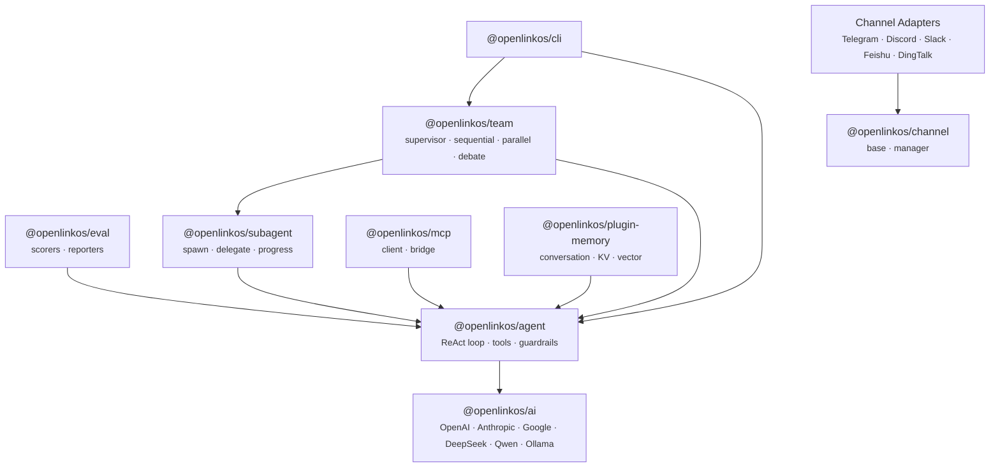

<p align="center">
  <strong>OpenLinkOS Agent Framework</strong><br/>
  A comprehensive TypeScript agent framework for building AI-powered applications.
</p>

<p align="center">
  <a href="https://github.com/openlinkos/agent/actions/workflows/ci.yml"></a>
  <a href="https://opensource.org/licenses/MIT"></a>
  <a href="https://github.com/openlinkos/agent"></a>
</p>

---

## Quick Start

```bash
pnpm add @openlinkos/ai @openlinkos/agent
```

```typescript
import { createModel } from "@openlinkos/ai";
import { createAgent } from "@openlinkos/agent";

const agent = createAgent({
  name: "assistant",
  model: createModel("openai:gpt-4o"),
  systemPrompt: "You are a helpful assistant.",
});

const { text } = await agent.run("What is the capital of France?");
console.log(text);
```

## Providers

| Provider | Model ID prefix |
|----------|-----------------|
| OpenAI | `openai:gpt-4o`, `openai:gpt-4o-mini` |
| Anthropic | `anthropic:claude-sonnet-4-20250514` |
| Google Gemini | `google:gemini-2.0-flash` |
| DeepSeek | `deepseek:deepseek-chat` |
| Qwen | `qwen:qwen-turbo` |
| Ollama | `ollama:llama3` |

All providers share a unified interface — swap models by changing a single string.

## Packages

| Package | Description |
|---------|-------------|
| [`@openlinkos/ai`](./packages/ai) | Unified model layer — streaming, tool calling, structured output, retry, fallback |
| [`@openlinkos/agent`](./packages/agent) | Single agent engine — ReAct loop, tools, guardrails, lifecycle hooks |
| [`@openlinkos/subagent`](./packages/subagent) | Child agent spawning — delegation, scoping, parallel execution |
| [`@openlinkos/team`](./packages/team) | Multi-agent teams — supervisor, sequential, parallel, debate coordination |
| [`@openlinkos/mcp`](./packages/mcp) | Model Context Protocol — connect to any MCP tool server |
| [`@openlinkos/eval`](./packages/eval) | Agent evaluation — scorers, reporters, built-in test suites |
| [`@openlinkos/channel`](./packages/channel) | Channel abstraction — unified message I/O for any platform |
| [`@openlinkos/plugin-memory`](./plugins/plugin-memory) | Memory plugin — conversation history, key-value store, vector retrieval |
| [`@openlinkos/cli`](./packages/cli) | CLI — scaffold projects, run agents, manage teams |

Channel adapters: [Telegram](./channels/channel-telegram) · [Discord](./channels/channel-discord) · [Slack](./channels/channel-slack) · [Feishu](./channels/channel-feishu) · [DingTalk](./channels/channel-dingtalk)

## Key Features

**ReAct Agent Loop** — Agents reason and act in a loop, calling tools and refining responses until the task is complete. Built-in guardrails (input/output validation, content filters) and lifecycle hooks for full control.

**Multi-Agent Teams** — Orchestrate agents with four coordination patterns:
- **Supervisor** — A lead agent delegates tasks, reviews results, and synthesizes a final output
- **Sequential** — Agents process in order, each building on the previous output
- **Parallel** — All agents work simultaneously; results are aggregated
- **Debate** — Agents argue opposing sides; a judge resolves conflicts

**Workflow Engine** — Define deterministic multi-step workflows with branching, loops, and parallel execution.

**Structured Output** — Request JSON responses conforming to a schema. Validated at the framework level.

**Agent-as-Tool** — Expose any agent as a tool that other agents can call, enabling deep composition.

**Middleware & Plugins** — Hook into the agent lifecycle with composable middleware. The memory plugin provides conversation history, persistent key-value storage, and semantic vector retrieval out of the box.

**Observability** — Every agent step is traced with token usage, latency, and tool call details. Plug in custom reporters for logging, metrics, or debugging.

**Rate Limiting** — Built-in rate limiter with configurable token and request quotas per time window.

**MCP Integration** — First-class Model Context Protocol support. Connect to any MCP-compatible tool server, or bridge MCP tools into your agents.

**Evals** — Evaluate agent quality with exact-match, inclusion, tool-call, and LLM-judge scorers. Generate reports in console or JSON format.

## Comparison

| | OpenLinkOS Agent | Vercel AI SDK | LangChain | Claude Agent SDK |
|---|---|---|---|---|
| Multi-agent teams | Supervisor, debate, sequential, parallel | No | Limited (LangGraph) | No |
| Agent-as-tool composition | Yes | No | Partial | No |
| Built-in MCP support | Client + bridge | No | Community | Native |
| Structured output | Schema-validated | Yes | Yes | Yes |
| Channel adapters | Telegram, Discord, Slack, Feishu, DingTalk | No | No | No |
| Eval framework | Built-in scorers + reporters | No | LangSmith (separate) | No |
| Memory plugin | Conversation + KV + vector | No | Yes | No |
| Provider support | OpenAI, Anthropic, Google, DeepSeek, Qwen, Ollama | OpenAI, Anthropic, Google, more | Broad | Anthropic only |
| Streaming | Yes | Yes | Yes | Yes |
| TypeScript-first | Yes | Yes | Python-first | Python-first |
| License | MIT | Apache 2.0 | MIT | MIT |

## Architecture



## Examples

```bash
cd examples/basic-chatbot && npx tsx chatbot.ts
```

| Example | What it shows |
|---------|---------------|
| [`basic-chatbot`](./examples/basic-chatbot) | Agent with tools and multi-turn conversation |
| [`multi-agent-debate`](./examples/multi-agent-debate) | Two agents debating with a judge |
| [`supervisor-team`](./examples/supervisor-team) | Supervisor delegating to specialized workers |
| [`mcp-tools`](./examples/mcp-tools) | Agent using MCP tools via stdio bridge |

## Development

```bash
git clone https://github.com/openlinkos/agent.git && cd agent
pnpm install
pnpm build
pnpm test        # 970+ tests
pnpm typecheck
pnpm lint
```

## Contributing

Contributions welcome. See [CONTRIBUTING.md](./CONTRIBUTING.md) for guidelines.

## License

[MIT](./LICENSE) — Copyright (c) 2026 OpenLinkOS contributors
